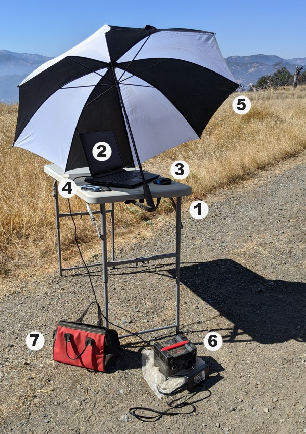
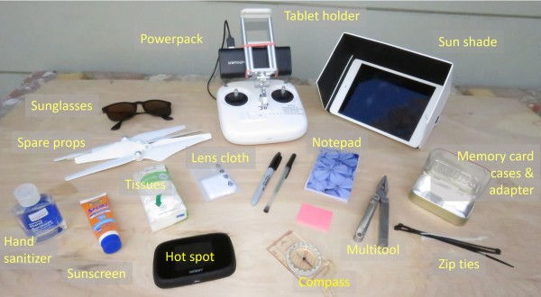

# Equipment

## Accessories {#accessories}

### Accessories for a Fixed-wing Mission

1. folding table
2. laptop for the flight management software (eMotion)
3. mouse 
4. memory card reader
5. umbrella to keep the laptop cool and screen more visible
6. 250W portable power station (big battery pack)
7. accessory bag with extra cables, memory cards, tools, etc.

### Accessories for a Quadcopter

## Memory Cards

### How many memory cards do I need?

Aim for enough memory cards for the number of flights you need to do each day. This way, you don't have to reformat the memory cards between flights, and the memory cards can serve as backup until you've got them backed-up on another storage device. 

We like 32GB memory cards, because they're relatively cheap and have more than enough capacity to hold all the images from a single flight, even if its a multi-spectral camera mounted on a fixed wing drone. Look for memory cards that have a fast read-write rate, and avoid low end generic brands.

### Keeping Memory Cards Organized

Typically when the drone lands you pull off the memory card and give it to someone who is in charge of the precious data. After a couple of flights, there are a bunch of memory cards sitting on someone's laptop, pocket, etc. and they all start to look the same. Sharpies, stickers, labels, and cases can help keep this organized and make sure they don't mixed up or accidentally erased.

*photo here of memory card cases / labels / holders. *

