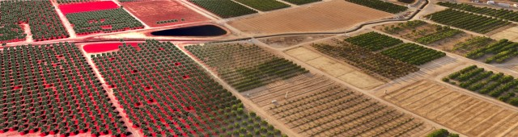

--- 
title: "Drone Mapping Field Guide"
date: "November, 2020"
output: bookdown::gitbook
site: bookdown::bookdown_site
documentclass: book
link-citations: yes
description: "A guide to mapping and data collection with drones"
---

# Introduction

Drone technology has advanced dramatically in the last decade, thanks to significant advances in navigation, engines, batteries, storage, proximity sensors, and payloads,..

